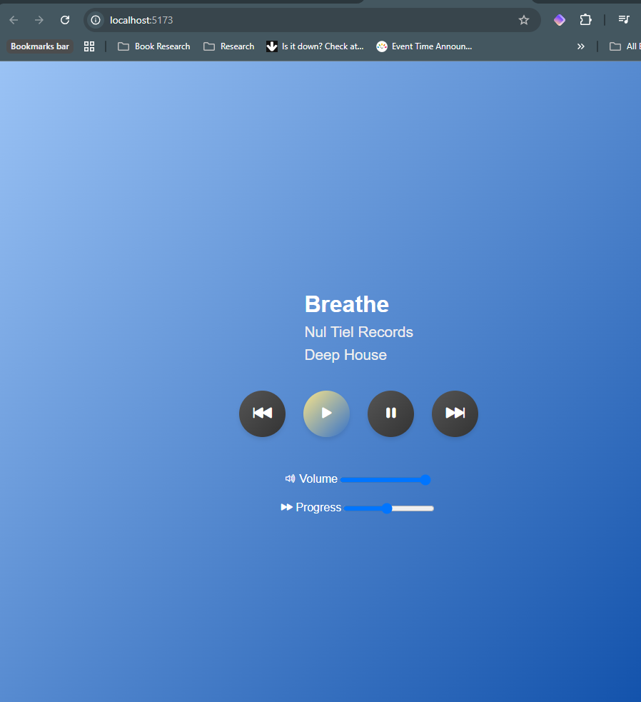
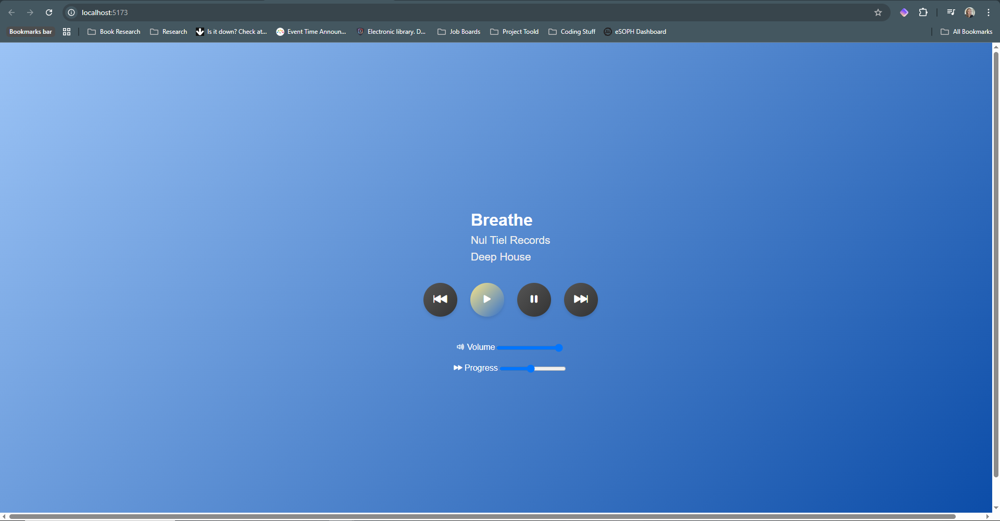

# Linear Media Player

The Linear Media Player is a modern, responsive web application built with React and TypeScript. It allows users to play audio tracks from a predefined playlist, control playback (play, pause, next, previous), adjust volume, and track progress. The player features a sleek, gradient-based design with smooth animations and is fully optimized for both desktop and mobile devices.

### Features

Play/Pause: Start and stop audio playback.

Next/Previous Track: Navigate through the playlist.

Volume Control: Adjust the volume using a slider.

Progress Bar: Track and seek through the current track.

Responsive Design: Optimized for all screen sizes.

Modern UI: Gradient backgrounds, rounded buttons, and smooth hover animations.

Dynamic Icons: Volume and playback icons change based on state.

### Installation

To run the Linear Media Player locally, follow these steps:

```bash
npm install
npm run dev
```

### Technologies used

Frontend: React, TypeScript

Styling: styled-components, Bootstrap

Icons: Bootstrap Icons

Build Tool: Vite

Testing: Jest, React Testing Library

Linting: ESLint

### Licence

This project is licensed under the MIT License. See the LICENSE file for details.

### Attribution

This project includes music from the following albums:

- **"Deep House"** by _Nul Tiel Records_ is licensed under [CC BY-NC-SA 4.0](https://creativecommons.org/licenses/by-nc-sa/4.0/).
- **"Neither and Both"** by _Brylie Christopher Oxley_ is licensed under [CC BY 4.0](https://creativecommons.org/licenses/by/4.0/).
